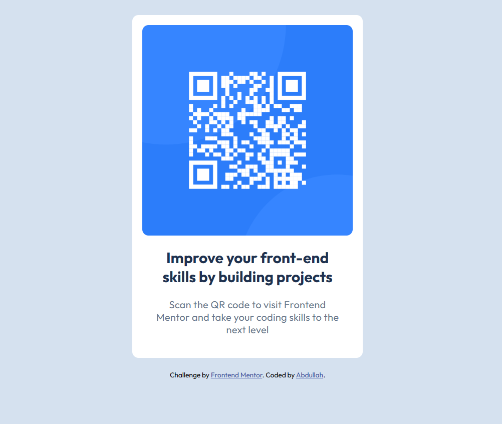

# Frontend Mentor - QR code component solution

This is a solution to the [QR code component challenge on Frontend Mentor](https://www.frontendmentor.io/challenges/qr-code-component-iux_sIO_H). 

## Overview

This is my attempted solution to the QR Code Component Challenge on Frontend Mentor. The challenge required building building a responsive layout for a card.

## Live Demo

[Live Demo of QR Code Component Solution](https://weebdora.github.io/qr-code-component/)

## Screenshot 

## What I learned myself

- Applied Google fonts in an actual project
- Tried to apply mobile-first design
- Found out common device widths like 480px for mobile, 768px for tablets, 1024px for laptops
- Revisited media queries syntax
- Better to use relative units with padding and fixed units with margin and borders
- And most importantly, worked with Figma for the first time. How to get color, fonts and other styles from a design file and converted it into code 